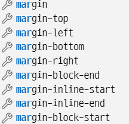

#### <!DOCTYPE> 선언

- html 5 이전 버전은 복잡한 양식
- html 5 버전 부터는 html 문서 맨 위에 아래와 같이만 써주면 된다.

```html
<!DOCTYPE html>
```


#### ** 한글 깨짐 현상 - 한글 인코딩 방식 적용 필요

```html
<meta charset="utf-8">
```


#### \<title>

- 페이지의 제목


#### \<h1> ~ \<h6>

- 본문 제목 태그


#### \<p>    -> paragraph

- 본문 문단 태그

​      -> 기본적으로 위아래에 공백이 존재


#### \<b> ~ \</b>  - 굵게  , \<i> ~ \</i> - 기울임

- \<b> 의 시맨틱 태그 버전으로 \<strong> 

  \<i> 의 시맨틱 태그 버전으로 \<em> 의 사용이 권장된다.

- \<b>, \<i> 는 단순 텍스트 꾸밈 형태,

  \<strong>, \<em> 은 음성 읽기 도구 등에서 '강조'로 받아들인다.

  -> 그러므로 단순 텍스트 꾸밈 목적이라면 \<b>, \<i> 사용 보다는 css로 꾸밈이 적절하겠다.

<< 참조 링크 - https://blog.acronym.co.kr/358 >>


#### * CSS 기본

```html
    <style>
        h1 {
            font-size: 64px;
            text-align: center;
        }
        p {
            font-size: 48px;
            text-align: center;
        }
        p i {    /* p 태그 속 i 태그에 적용하라는 의미 */
            font-size: 60px;
            text-align: center;
        }
    </style>
```


##### *** div 태그 속 p 태그가 여러 개 존재할 때, 그 중 하나만 수식하고 싶다면?

1. class 나 id 부여

2. 요소:nth-of-type { }

   요소:nth-of-child { }  

   라는 가상 클래스를 사용한 선택자 활용

   ex)

   ```html
   <div>
   	<h3>어린 왕자</h3>
       <p>1장</p>
       <p>2장</p>
   </div>
   ```

   - p:nth-child(2) { color: red; } 

     -> p 요소이면서, 현 상위 태그의 2 번째 자식 태그일 때 빨간색 표시

     ​    => <u>'1장'이 빨간색으로 표시</u>

   - p:nth-type(2) { color: blue; }

     -> 어떤 태그 내의 두 번째 p 태그일 때 파란색 표시

​                  => <u>'2장'이 파란색으로 표시</u>




 ##### *** Tip. 위 margin 속성을 이용해주면, 해당 공간의 여백을 설정해줄 수 있다.


#### \# 링크

- \<a>~\</a> 태그 사용

```html
<a href="https://google.com">현재 탭에서 구글 링크</a>
<a href="https://google.com" target="_blank">새 탭에서 구글 링크</a>
<a href="#">새로고침</a>  <!-- # 를 주면 현재 위치를 새로고침 하는 효과-->
                         <!-- # 는 페이지의 최상단으로 이동한다는 의미
                                   즉, 스크롤 맨 위로 이동 -->
```


#### \# 이미지

- \ 태그 사용

```html


<!-- width, height를 안 적으면 원래 크기대로 -->
<!-- width나 height만 쓰면 사진 원본 비율 대로 width나 height에 맞춰 크기 조정 -->
<!-- width, height 모두 쓰면 원본 비율 무시하고 설정대로 크기 조정 -->
```


- 이미지는 기본적으로 왼쪽 정렬, 이미지 가운데 정렬 해주려면? 

  -> 아래와 같이 써주면 된다.

```html
<style>
    img {
        display: block;
        margin-left: auto;
        margin-right: auto;
    }
</style>
```

#####       **주의

​     text-align: center;  와

​     margin: 0 auto;      를 이용한 정렬은 무슨 차이?

​    ㄱ. text-align: center;

​           => inline 요소가 정렬이 되는 방식

​    ㄴ. margin: 0 auto;

​           => block 요소가 정렬이 되는 방식

​           => 단, 해당 block에 width가 지정되어 있어야 한다.


