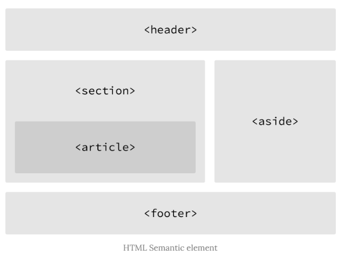

## 시맨틱 웹(Semantic Web)?


- 인터넷 사용자는 원하는 정보를 얻기 위해 검색 사이트를 이용

  => **<u>웹 사이트는 검색엔진에의 노출이 매우 중요</u>**


- SEO(검색엔진 최적화: Search Engine Optimization)?

  => 일종의 마케팅 도구

  ​      검색엔진이 자신의 웹 사이트를 검색하기 알맞은 구조로 조정하는 것

​              => 이는 당연히 <u>검색엔진이 어떻게 웹사이트의 정보를 수집하는지</u> 알아야 가능


- 로봇(Robot)?

  => 검색엔진은 이 프로그램을 이용하여 전세계의 웹사이트 정보를 수집.

  => 이용자가 검색할 만한 키워드를 미리 예상하여 검색 키워드에 대응하는 인덱스를 만들어 둚   =>   **인덱싱**

  ​      (검색어 자동 완성 같은..)

  => 인덱스 생성 시 사용되는 정보는 결국 HTML code => ***<u>시맨틱 요소를 해석하게 됨</u>***


```html
<font size="6"><b>Hello</b></font>
<h1>Hello</h1>
```

=> 위 두 코드는 동일하지만, 아래의 코드가 훨씬 더 개발자의 의도가 명확히 드러나도 있다.

​      ~> <u>코드의 가독성은 높이고, 유지보수는 더욱 쉬워짐</u>


\*\* **기존의 잡다한 데이터 집합이었던 웹페이지를 '의미'와 '관련성'을 지니는 거대한 데이터베이스로 구축하고자 하는 발상 => '시맨틱 웹'**


> non-semantic 요소
>
> div, span 등


> semantic 요소
>
> form, table, img, header, nav, aside, section, article, footer 등

