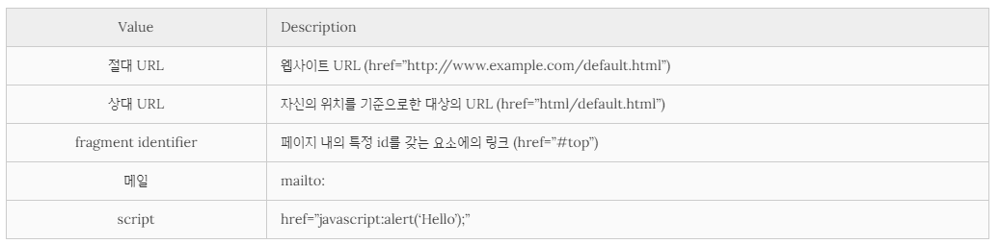

## HTML의 핵심 Hyperlink


- Hyper?

  \- 컴퓨터 용어

  \- 텍스트 등의 정보가 동일 선상에 있는 것이 아니라 <u>다중으로 연결되어 있는 상태</u>를 의미

  ​	=> 기준 문서나 텍스트의 선형성, 고정성의 제약에서 벗어나 <u>**사용자가 원하는 순서대로 원하는 정보에**</u>

  ​		<u>**접근이 가능**</u>

  \- HTML link는 hyperlink를 의미

  \- **a(anchor) 태그**가 그 역할을 담당


### \*\*\* a 태그

##### 	1. href 속성

​		\- 이동하고자 하는 파일의 위치(경로)를 받음

> **Tip. 디렉터리?**
>
> - 루트 디렉터리
>
>   : 파일 시스템 계층 구조 상의 최상위 디렉터리
>
>   - Unix : /
>   - Windows: C:\\
>
> - 홈 디렉터리
>
>   : 시스템의 사용자에게 각각 할당된 개별 디렉터리
>
>   - Unix : /Users/[계정명]
>   - Windows : C:\\Users\\[계정명]
>
> - 작업 디렉터리
>
>   : 작업 중인 파일이 위치한 디렉터리
>
>   - ./
>
> - 부모 디렉터리
>
>   : 작업 디렉터리의 부모 디렉터리
>
>   - ../

​		\- href 어트리뷰트에 사용 가능한 값



​	( 출처 : poiemaweb.com/html5-tag-link )


##### 	2. download 속성

​		\- href에 file 경로를 적어놓고, download 속성을 넣어주면 해당 파일을 다운로드 받을 수 있다.

```html
<a href="html/my.html">Local file</a>
```


	##### 	3. target 속성

​		\- 링크 클릭 시 윈도우를 어떻게 오픈할 지를 지정

​			ㄱ. _self

​				=> 링크 클릭 시 현재 윈도우에서 오픈 **( 디폴트 )**

​			ㄴ. _blank

​				=> 링크 클릭 시 새로운 윈도우나 탭에서 오픈