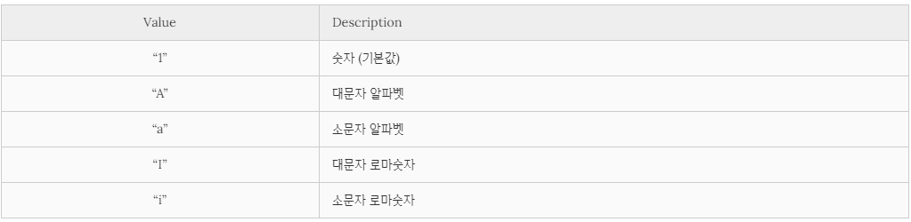
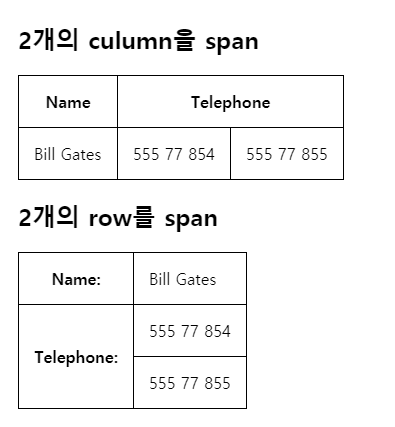

# 목록(List)과 표(Table) 형식 표현을 위한 태그


#### 1. 목록(List)


 - 공통적으로 항목을 li 태그 여러 개를 자식으로 가짐

   

	##### 	ㄱ. ul  ( Unordered List  )

​		\- 순서 없는 목록

```html
<ul>
    <li>1번</li>
    <li>2번</li>
</ul>
```


	##### 	**ㄴ. ol (  Ordered List  )**

​		\- 순서 있는 목록

​		\- type 속성을 지정하면 앞에 붙는 숫자 타입을 정해줄 수 있다.



( 출처 : https://poiemaweb.com/html5-tag-list-table )

​		\- ol의 자식 태그인 ul 태그에 value 속성을 주면, 앞에 붙는 번호 값을 줄 수 있다.

```html
<ol type="I">  <!-- 로마 대문자 -->
  <li value="2">2번</li>
  <li value="4">4번</li>
  <li>5번이 붙음</li>
</ol>
```

​		\- start 속성으로 리스트의 시작 값을 지정이 가

```html
<ol start="3">
  <li>3번</li>
  <li>4번</li>
  <li>5번</li>
</ol>
```

​		\- reversed 속성을 지정하면 리스트의 순서 값을 역으로 표현

​			=> 요소의 순서가 바뀌는 것이 아닌 앞에 붙는 숫자만 내림차순으로 부여되는 것.

```html
<ol reversed>
  <li>3번</li>
  <li>2번</li>
  <li>1번</li>
</ol>
```


##### 	ㄷ. 중첩 목록

​		\- ul과 ol이 부모-자식으로 엮여있는 목록 구조

​		Tip. 이 구조는 주로 네비게이션 메뉴를 만들 때 사용


#### 2. 테이블

- 표를 만들 때 사용
- 과거엔 테이블 태그를 사용하여 레이아웃을 구성하기도..
- 모던 웹에서는 주로 공간 분할 태그인 div를 이용하여 레이아웃을 구성


##### \* 테이블을 구성하는 태그들

​	ㄱ. table : 표를 감싸는 태그

​	ㄴ. tr : 표 내부의 행

​	ㄷ. th : 행 내부의 제목 셀

​	ㄹ. td : 행 내부의 일반 셀


##### \* 테이블 태그의 속성

​	ㄱ. border : 표 테두리 두께 지정. => <u>*CSS border property 사용이 더 적절한 방법*</u>

​	ㄴ. rowspan : 해당 셀이 점유하는 행의 수 지정

​	ㄷ. colspan : 해당 셀이 점유하는 열의 수 지정

```html
<!DOCTYPE html>
<html>
  <head>
    <style>
      table, th, td {
        border: 1px solid black;
        border-collapse: collapse;
      }
      th, td {
        padding: 15px;
      }
    </style>
  </head>
  <body>
    <h2>2개의 culumn을 span</h2>
    <table>
      <tr>
        <th>Name</th>
        <th colspan="2">Telephone</th>
      </tr>
      <tr>
        <td>Bill Gates</td>
        <td>555 77 854</td>
        <td>555 77 855</td>
      </tr>
    </table>

    <h2>2개의 row를 span</h2>
    <table>
      <tr>
        <th>Name:</th>
        <td>Bill Gates</td>
      </tr>
      <tr>
        <th rowspan="2">Telephone:</th>
        <td>555 77 854</td>
      </tr>
      <tr>
        <td>555 77 855</td>
      </tr>
    </table>
  </body>
</html>
```

- 결과



( 출처 : https://poiemaweb.com/html5-tag-list-table )